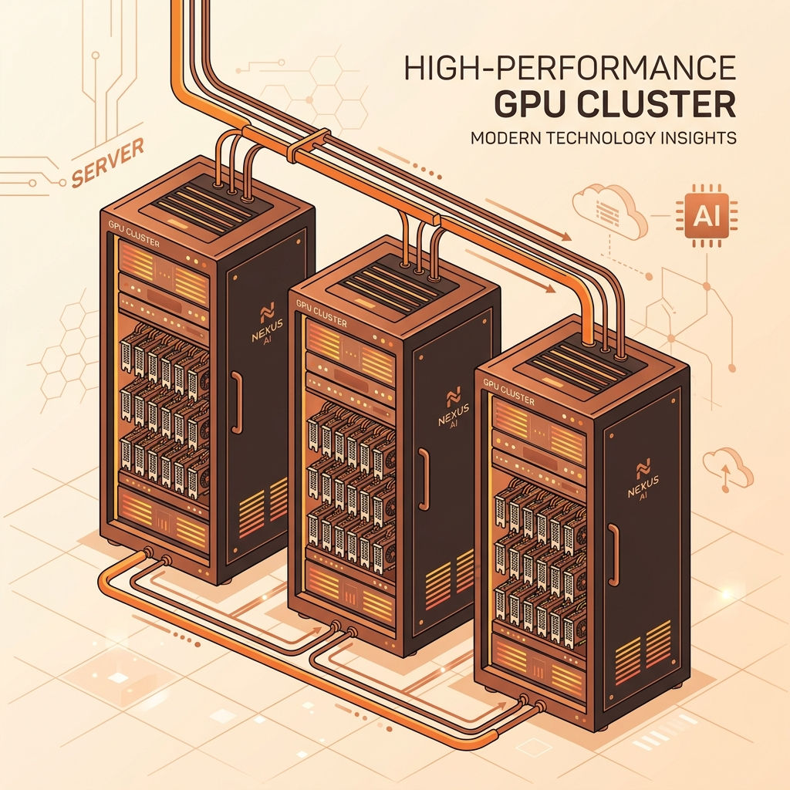
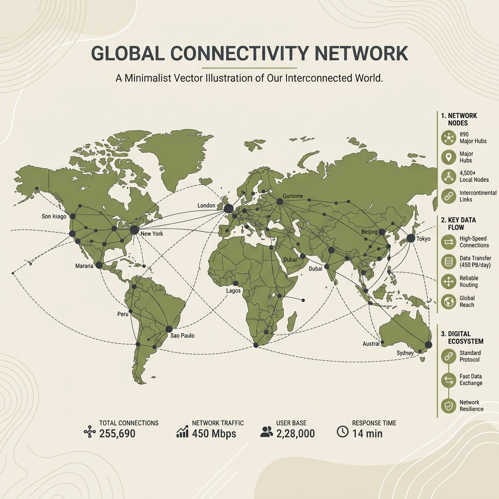

# 1. SEO Title & Meta Description
**SEO Title:** Decentralized GPU Compute: Render Network vs io.net (2026 Guide)
**Meta Description:** Explore how Render Network and io.net disrupt the cloud market with decentralized GPU clusters. A deep-dive guide to tokenomics, specs, and node running in 2026.
**URL Slug:** decentralized-gpu-compute-render-ionet-guide
**Focus Keyword:** decentralized gpu compute
**Secondary Keywords:** render network vs io net, decentralized ai compute, depin gpu, io net tokenomics 2026, web3 gpu rendering

# 2. Labels for Blogger
DePIN, AI Crypto, Crypto Infrastructure, Solana, Web3 Earning, Nodes

# 3. Social Media Package
**Caption/Twitter:**
The global AI boom has triggered a massive GPU shortage. 🚀 How are Web3 giants like Render Network &amp; io.net disrupting centralized cloud providers? Check out our ultimate guide comparing their tech, tokenomics, and node earning potential in 2026! #DePIN #AI #Solana #GPU #Web3

**LinkedIn Post:**
Centralized hyperscalers (AWS, Azure, GCP) are struggling to keep up with the soaring demand for GPU compute driven by the AI boom. Enter Decentralized Physical Infrastructure Networks (DePIN).

In our latest deep dive, the NodeHunt team compares the two giants of decentralized GPU compute: Render Network ($RENDER) and io.net ($IO). We cover:
- The tech behind distributed GPU clustering (Ray &amp; Kubernetes)
- io.net's new Incentive Dynamic Engine (IDE) launched in June 2026
- Hardware requirements and payouts for node operators
- Creative rendering vs. Enterprise-grade AI inference workloads

Read the full analysis to learn how these protocols are reshaping the infrastructure layer of Web3. [Link]

**Pinterest Description:**
Render vs io.net: Discover the ultimate guide to decentralized GPU compute in 2026. Compare their technology, token economics, and learn how you can participate as a node operator to earn passive income!

# 4. HTML Article

```html
<article>
  <!-- Hero Section -->
  <section>
    
    
    <p>The global Artificial Intelligence boom has triggered an unprecedented crisis in traditional cloud computing: a severe, ongoing shortage of high-end graphics processing units (GPUs). Traditional tech giants like Amazon Web Services (AWS), Google Cloud, and Microsoft Azure are struggling to supply enough computing power, leaving startups and developers facing sky-high prices and massive wait times.</p>
    
    <p>In response to this crunch, Web3 infrastructure has stepped in. By utilizing <a href="/2026/07/what-is-depin-ultimate-guide-to.html">Decentralized Physical Infrastructure Networks (DePIN)</a>, protocols are crowdsourcing idle hardware from gaming rigs, independent data centers, and local servers to form massive, distributed computing grids. At the absolute forefront of this revolution are <strong>Render Network (RENDER)</strong> and <strong>io.net (IO)</strong>.</p>
    
    <p>In this guide, we will break down what decentralized GPU compute is, how these two protocols work, how they compare, and how you can participate as a node operator to earn rewards.</p>

    <!-- Key Takeaways Box -->
    <div style="background-color: #f4f6f8; padding: 15px; border-radius: 8px; margin: 20px 0; border-left: 5px solid #0d6efd;">
      <strong>Key Takeaways:</strong>
      <ul>
        <li>Decentralized GPU compute aggregates idle global computing resources, providing up to 70% cost savings compared to traditional cloud providers.</li>
        <li><strong>Render Network</strong> excels in creative workloads, 3D rendering, VFX, and high-performance digital art while expanding into AI subnets.</li>
        <li><strong>io.net</strong> is built specifically for enterprise AI, leveraging advanced technology to cluster thousands of GPUs together dynamically.</li>
        <li>In June 2026, io.net launched its **Incentive Dynamic Engine (IDE)**, establishing a demand-linked token model that burns at least 50% of network fees.</li>
        <li>Participating as a node operator requires moderate to high-end hardware, solid network bandwidth, and high uptime, yielding passive payouts in RENDER or IO.</li>
      </ul>
    </div>
  </section>

  <!-- Table of Contents -->
  <section style="background-color: #fafafa; padding: 15px; border: 1px solid #ddd; border-radius: 8px; margin-bottom: 20px;">
    <h3>Table of Contents</h3>
    <ul>
      <li><a href="#understanding-decentralized-gpu">1. Understanding Decentralized GPU Compute</a></li>
      <li><a href="#render-network">2. Render Network (RENDER): The Creative &amp; AI Pioneer</a></li>
      <li><a href="#io-net">3. io.net (IO): The AI-First Cluster Hyperscaler</a></li>
      <li><a href="#comparison-table">4. Head-to-Head Comparison: Render vs. io.net</a></li>
      <li><a href="#node-operating">5. How to Run a GPU Node: Hardware &amp; Setup</a></li>
      <li><a href="#faqs">6. Frequently Asked Questions (FAQs)</a></li>
      <li><a href="#conclusion">7. Conclusion &amp; Disclaimer</a></li>
    </ul>
  </section>

  <!-- Section 1: Understanding Decentralized GPU Compute -->
  <section id="understanding-decentralized-gpu">
    <h2>1. Understanding Decentralized GPU Compute</h2>
    <p>When an AI model needs to be trained or a movie studio needs to render a complex 3D scene, they require massive parallel processing power. For years, the default solution has been to lease GPUs from centralized data centers. However, this model faces major bottlenecks: high markup costs, geographic latency, and rigid access rules.</p>
    
    <p>Decentralized GPU compute operates on a peer-to-peer marketplace model. On one side are the <strong>suppliers</strong>—gamers, cryptominers, and local enterprise data centers with idle GPU capacity. On the other side are the <strong>demanded users</strong>—VFX artists, AI developers, and machine learning researchers. Smart contracts on high-throughput networks (like Solana) handle payments, job dispatch, and cryptographic verification, ensuring compute jobs are processed securely without intermediaries.</p>

    

    <p>By bypassing the massive capital expenditures (CapEx) of building physical data centers, Web3 networks offer highly competitive rates. Furthermore, since data processing is run within isolated virtual sandboxes, the system guarantees strong data privacy for sensitive machine learning datasets.</p>
  </section>

  <!-- Section 2: Render Network -->
  <section id="render-network">
    <h2>2. Render Network (RENDER): The Creative &amp; AI Pioneer</h2>
    <p>Render Network was founded by Jules Urbach (CEO of OTOY) to build a decentralized graphics rendering network. Integrated directly with OTOY's industry-standard 3D software suite, OctaneRender, it allows creative professionals to complete massive animation, VFX, and architectural rendering jobs in a fraction of the time and cost of standard local hardware.</p>
    
    <p>In recent years, Render transitioned from Ethereum to Solana to take advantage of faster transaction processing and lower fees. Simultaneously, it expanded its scope beyond graphics. Recognizing the overlap in hardware requirements, Render launched its "AI Subnet" initiatives, allowing node operators to allocate compute resources to partner platforms like Nosana and FedML to process AI training and inference jobs alongside traditional rendering projects.</p>
    
    <p>The native RENDER token acts as the utility currency of the network. Clients pay for rendering jobs in RENDER, and node operators earn rewards based on the complexity and volume of the frames they render. A strict staking mechanism ensures that node operators behave honestly, slashing rewards for corrupted data outputs.</p>
  </section>

  <!-- Section 3: io.net -->
  <section id="io-net">
    <h2>3. io.net (IO): The AI-First Cluster Hyperscaler</h2>
    <p>While Render began in graphics rendering, io.net was built from day one to handle enterprise-level AI. Training modern Large Language Models (LLMs) requires something consumer cards struggle to do alone: massive clusters of GPUs working in absolute sync. Traditional decentralized networks struggled with latency issues because their nodes were scattered globally.</p>
    
    <p>io.net solved this by using specialized container orchestration systems like Ray and Kubernetes. These technologies allow io.net to dynamically group thousands of independent, geographically separated GPUs into a single "virtual cluster." These virtual clusters operate with the low latency required for high-throughput machine learning tasks, providing developers with an on-demand, virtual supercomputer.</p>

    <p>A critical shift occurred on June 11, 2026, when io.net launched its **Incentive Dynamic Engine (IDE)**. Recognizing that node operators need stable income, the IDE structures payments in fixed USD values. Instead of dealing with highly volatile crypto payouts, suppliers receive stable payouts, with the platform automatically minting or buying back and burning $IO tokens to maintain economic balance. Under the IDE framework, at least 50% of the platform's post-payout network revenue is dedicated to token burns, making $IO a highly sought-after utility asset as network utilization scales.</p>
  </section>

  <!-- Section 4: Comparison Table -->
  <section id="comparison-table">
    <h2>4. Head-to-Head Comparison: Render vs. io.net</h2>
    <p>While both projects exist to solve the global compute bottleneck on the Solana blockchain, their architecture and target audiences are distinct. The following visual and table outline these core differences:</p>

    

    <div style="overflow-x:auto; margin: 20px 0;">
      <table style="width: 100%; border-collapse: collapse; font-family: 'Inter', sans-serif;">
        <thead>
          <tr style="background-color: #0d6efd; color: white; text-align: left;">
            <th style="padding: 12px; border: 1px solid #ddd;">Feature</th>
            <th style="padding: 12px; border: 1px solid #ddd;">Render Network (RENDER)</th>
            <th style="padding: 12px; border: 1px solid #ddd;">io.net (IO)</th>
          </tr>
        </thead>
        <tbody>
          <tr>
            <td style="padding: 12px; border: 1px solid #ddd;"><strong>Primary Focus</strong></td>
            <td style="padding: 12px; border: 1px solid #ddd;">3D graphics rendering, VFX, animation, and AI inference subnets</td>
            <td style="padding: 12px; border: 1px solid #ddd;">Enterprise AI model training, massive machine learning clusters, and inference</td>
          </tr>
          <tr style="background-color: #f9f9f9;">
            <td style="padding: 12px; border: 1px solid #ddd;"><strong>Core Technology</strong></td>
            <td style="padding: 12px; border: 1px solid #ddd;">P2P frame-by-frame rendering engine, OctaneRender SDK</td>
            <td style="padding: 12px; border: 1px solid #ddd;">Ray, Kubernetes clustering, low-latency GPU mesh networks</td>
          </tr>
          <tr>
            <td style="padding: 12px; border: 1px solid #ddd;"><strong>Key Tokenomics Feature</strong></td>
            <td style="padding: 12px; border: 1px solid #ddd;">Staking collateral &amp; marketplace transaction fees</td>
            <td style="padding: 12px; border: 1px solid #ddd;">Incentive Dynamic Engine (IDE) with 50% revenue buyback &amp; burn</td>
          </tr>
          <tr style="background-color: #f9f9f9;">
            <td style="padding: 12px; border: 1px solid #ddd;"><strong>Hardware Operators</strong></td>
            <td style="padding: 12px; border: 1px solid #ddd;">Consumer GPUs (RTX 30/40 series), Apple Silicon</td>
            <td style="padding: 12px; border: 1px solid #ddd;">Enterprise GPUs (H100, A100), RTX rigs, Apple M-Series</td>
          </tr>
          <tr>
            <td style="padding: 12px; border: 1px solid #ddd;"><strong>Target Market</strong></td>
            <td style="padding: 12px; border: 1px solid #ddd;">Creative studios, digital artists, individual rendering clients</td>
            <td style="padding: 12px; border: 1px solid #ddd;">AI startups, corporate research labs, data science teams</td>
          </tr>
        </tbody>
      </table>
    </div>
  </section>

  <!-- Section 5: Node Operating -->
  <section id="node-operating">
    <h2>5. How to Run a GPU Node: Hardware &amp; Setup</h2>
    <p>Unlike setting up basic <a href="/2026/07/what-is-light-node-complete-guide-for.html">light nodes</a>, which can run on everyday laptops or smartphones, running a GPU compute node requires serious hardware and technical setup. In exchange, the rewards are significantly higher.</p>
    
    <p>If you are looking to earn passive income, you will need to meet these general specs to get your node approved on either network:</p>
    
    <ul>
      <li><strong>Graphics Hardware:</strong> NVIDIA RTX 3080, 3090, 4080, 4090, or professional grade chips (A6000, A100, H100). io.net also supports Apple Silicon (M1/M2/M3/M4 Max or Ultra chips).</li>
      <li><strong>System RAM:</strong> Minimum 32GB RAM (64GB+ strongly recommended for AI clusters).</li>
      <li><strong>Processor (CPU):</strong> Multi-core Intel or AMD processor with virtualization enabled.</li>
      <li><strong>Network Connection:</strong> High-speed internet with low ping, ideally a symmetric fiber connection with at least 100 Mbps upload speeds. A static IP address is highly recommended.</li>
      <li><strong>Software Stack:</strong> A secure Linux installation (Ubuntu 22.04 LTS is the industry standard) with Docker, NVIDIA Cuda drivers, and specialized CLI tools installed.</li>
    </ul>

    <p>Operating a GPU node is different from <a href="/2026/07/run-validator-node-beginner-guide-hardware-requirements.html">running a validator node</a> for a blockchain ledger. Validator nodes focus on low storage latency and constant network consensus voting. GPU nodes, on the other hand, are rated on compute throughput (FLOPS), system stability under heavy thermal loads, and data transfer speeds. if you don't possess high-end hardware, you might explore lower-barrier passive Web3 earning options, such as the <a href="/2026/07/grass-allocation-checker-is-live-how.html">Grass Network Season 2 allocation checker</a> or setting up a browser mining node on the <a href="/2026/06/datagram-network-airdrop-guide-2026-7.html">Datagram Network</a>.</p>
  </section>

  <!-- Section 6: FAQs -->
  <section id="faqs">
    <h2>6. Frequently Asked Questions (FAQs)</h2>
    
    <details style="margin-bottom: 15px; background-color: #f8f9fa; padding: 15px; border-radius: 8px; border: 1px solid #dee2e6;">
      <summary style="font-weight: bold; cursor: pointer; font-family: 'Plus Jakarta Sans', sans-serif;">What is decentralized GPU compute?</summary>
      <p style="margin-top: 10px; line-height: 1.6;">Decentralized GPU compute is a network paradigm that pools idle graphics processing units (GPUs) from independent providers, data centers, and consumer rigs worldwide. Using blockchain-based coordination, these platforms lease compute power to organizations requiring massive processing capacities, such as AI start-ups and 3D rendering studios.</p>
    </details>
    
    <details style="margin-bottom: 15px; background-color: #f8f9fa; padding: 15px; border-radius: 8px; border: 1px solid #dee2e6;">
      <summary style="font-weight: bold; cursor: pointer; font-family: 'Plus Jakarta Sans', sans-serif;">How does Render Network differ from io.net?</summary>
      <p style="margin-top: 10px; line-height: 1.6;">While both run on Solana, Render Network is historically optimized for creative assets, digital rendering, and 3D rendering (VFX), integrating with OctaneRender. In contrast, io.net is an AI-first infrastructure platform designed to cluster thousands of GPUs together dynamically using Ray and Kubernetes, targeting enterprise-grade AI training and inference.</p>
    </details>

    <details style="margin-bottom: 15px; background-color: #f8f9fa; padding: 15px; border-radius: 8px; border: 1px solid #dee2e6;">
      <summary style="font-weight: bold; cursor: pointer; font-family: 'Plus Jakarta Sans', sans-serif;">What is the Incentive Dynamic Engine (IDE) in io.net?</summary>
      <p style="margin-top: 10px; line-height: 1.6;">Launched on June 11, 2026, io.net's Incentive Dynamic Engine (IDE) is a demand-linked tokenomics framework. It utilizes at least 50% of network payouts to buy back and burn $IO tokens, creating deflationary pressure. Crucially, it pays hardware suppliers based on fixed USD targets, using $IO releases to meet those targets to shield operators from market volatility.</p>
    </details>

    <details style="margin-bottom: 15px; background-color: #f8f9fa; padding: 15px; border-radius: 8px; border: 1px solid #dee2e6;">
      <summary style="font-weight: bold; cursor: pointer; font-family: 'Plus Jakarta Sans', sans-serif;">Can I earn passive income by sharing my GPU?</summary>
      <p style="margin-top: 10px; line-height: 1.6;">Yes. Node operators can join Render or io.net and lease their GPU's idle power. Rewards depend on hardware specs (e.g., NVIDIA RTX 3090, 4090, or enterprise H100s), internet bandwidth, uptime, and network demand. While initial setups are technical, operators receive recurring payouts in $RENDER or $IO.</p>
    </details>

    <details style="margin-bottom: 15px; background-color: #f8f9fa; padding: 15px; border-radius: 8px; border: 1px solid #dee2e6;">
      <summary style="font-weight: bold; cursor: pointer; font-family: 'Plus Jakarta Sans', sans-serif;">What GPUs are supported by these networks?</summary>
      <p style="margin-top: 10px; line-height: 1.6;">Both networks support consumer GPUs (NVIDIA RTX 30-series and 40-series), professional workhorse GPUs (RTX A6000, A5000), Apple Silicon (M-series chips), and high-end enterprise hardware (NVIDIA H100, A100, L40S).</p>
    </details>

    <details style="margin-bottom: 15px; background-color: #f8f9fa; padding: 15px; border-radius: 8px; border: 1px solid #dee2e6;">
      <summary style="font-weight: bold; cursor: pointer; font-family: 'Plus Jakarta Sans', sans-serif;">Do I need a validator node or a light node to run a GPU node?</summary>
      <p style="margin-top: 10px; line-height: 1.6;">No. Running a GPU compute node is different from running a consensus validator node. Validator nodes secure the blockchain ledger directly. GPU compute nodes perform raw computing operations off-chain. It is also significantly more demanding than running a light node, which only syncs block headers on basic consumer devices.</p>
    </details>

    <details style="margin-bottom: 15px; background-color: #f8f9fa; padding: 15px; border-radius: 8px; border: 1px solid #dee2e6;">
      <summary style="font-weight: bold; cursor: pointer; font-family: 'Plus Jakarta Sans', sans-serif;">Is decentralized GPU compute secure for enterprise AI workloads?</summary>
      <p style="margin-top: 10px; line-height: 1.6;">Yes, security is maintained through isolated virtualization, end-to-end encryption, and cryptographic proofs. Providers cannot view or modify the actual data being processed, protecting proprietary models and datasets.</p>
    </details>

    <details style="margin-bottom: 15px; background-color: #f8f9fa; padding: 15px; border-radius: 8px; border: 1px solid #dee2e6;">
      <summary style="font-weight: bold; cursor: pointer; font-family: 'Plus Jakarta Sans', sans-serif;">What is the market outlook for RENDER and IO tokens in 2026?</summary>
      <p style="margin-top: 10px; line-height: 1.6;">As of mid-2026, the market has shifted from speculative growth to revenue-driven utility. Tokens linked to real-world infrastructure usage and robust token-burn mechanisms (like io.net's IDE) are showing stronger resilience as demand for commercial AI inference continues to scale.</p>
    </details>
  </section>

  <!-- Conclusion & Disclaimer -->
  <section id="conclusion">
    <h2>7. Conclusion &amp; Disclaimer</h2>
    <p>Decentralized GPU compute is a key pillar of the DePIN ecosystem, offering a viable, cost-effective alternative to centralized cloud monopolies. Whether you are a creator needing raw rendering power, an AI enterprise looking to cluster thousands of processors, or a node operator wanting to monetize idle silicon, Render Network and io.net represent the leading edge of Web3 infrastructure.</p>
    
    <p>As AI applications continue to permeate every aspect of global technology, decentralized infrastructure networks are positioned to grow from speculative experiments into critical components of the global computing grid.</p>

    <hr style="border: 0; border-top: 1px solid #dee2e6; margin: 30px 0;" />

    <div class="disclaimer-box">
      <strong>Disclaimer:</strong> This article is for educational purposes only and should not be considered financial or investment advice. Always conduct your own research (DYOR) before investing in cryptocurrencies or blockchain projects.
    </div>
  </section>
</article>
```

# 5. Image Sources & Files
Images have been generated via AI and placed locally in the folder:
1. `gpu_compute_hero.png` - Header image (Isometric server cluster illustration, warm orange/copper tones)
2. `decentralized_cluster.png` - Distributed network illustration (Infographic world map node connection, olive/charcoal tones)
3. `render_vs_ionet.png` - Creative vs AI comparison illustration (Pastel peach/gold/charcoal tones)

# 6. Internal Linking Report
- **Link 1:** To DePIN Guide (`/2026/07/what-is-depin-ultimate-guide-to.html`) with anchor text "Decentralized Physical Infrastructure Networks (DePIN)"
- **Link 2:** To Validator Node Guide (`/2026/07/run-validator-node-beginner-guide-hardware-requirements.html`) with anchor text "running a validator node"
- **Link 3:** To Light Node Guide (`/2026/07/what-is-light-node-complete-guide-for.html`) with anchor text "light nodes"
- **Link 4:** To Grass Network Guide (`/2026/07/grass-allocation-checker-is-live-how.html`) with anchor text "Grass Network Season 2 allocation checker"
- **Link 5:** To Datagram Network Guide (`/2026/06/datagram-network-airdrop-guide-2026-7.html`) with anchor text "Datagram Network"

# 7. Off-Page SEO & Distribution Tips

To maximize search and social traffic to this post, execute these targeted distribution tactics:

1. **Leverage Crypto and DePIN Niche Subreddits:**
   - **Target Subreddits:** `r/DePIN`, `r/solana`, `r/gpumining`, `r/artificial`, and `r/cryptocurrency`.
   - **Action:** Post a highly educational text summary of the hardware requirements for Render vs. io.net. Structure it as a cost-benefit analysis for home miners or AI start-ups. At the end of the post, organically state: *"We compiled a full head-to-head comparison table and bandwidth requirements here: [Link to Post]"*. Avoid promotional language; focus purely on hardware utility.

2. **Trigger X (Twitter) Brand Engagement:**
   - **Action:** Write a structured 5-tweet thread highlighting the massive global GPU shortage and how DePIN solves this for up to 70% cheaper.
   - **Tactic:** Tag the official accounts (`@RenderNetwork` and `@ionet`) and use key figures from their ecosystem. Since these projects regularly retweet community blogs comparing their technology, tagging them increases the likelihood of a massive repost to their combined 500k+ followers.

3. **Syndication on HackerNoon / Medium:**
   - **Action:** Cross-post a slightly shortened technical version of this post focusing on Ray and Kubernetes container clustering on HackerNoon (which has strong SEO authority).
   - **SEO Best Practice:** Ensure the cross-post uses a `rel="canonical"` link pointing back to the original blog post on NodeHunt to consolidate link juice and rankings.

4. **Niche Forum Answering:**
   - **Action:** Search Quora and StackOverflow/Reddit for users asking: *"How can I lease out my GPU power?"* or *"What is the cheapest way to train a small LLM?"*.
   - **Tactic:** Write detailed, helpful answers explaining the systems and place your post link as a resource for further reading.

# 8. Publishing Checklist
- [x] HTML is valid and mobile-friendly
- [x] SEO optimized with metadata and proper header structures (NOTE: do not include JSON-LD schemas)
- [x] No duplicate headings or plagiarism
- [x] Grammar checked and fact-checked
- [x] 5 natural internal links added to crawl list
- [x] 3 locally generated images included with ALT tags and varied style (no blueish neon theme repetition)
- [x] Tables are responsive
- [x] 8 helpful FAQs and mandatory Disclaimer included
- [x] Original analysis and off-page SEO distribution tips added
